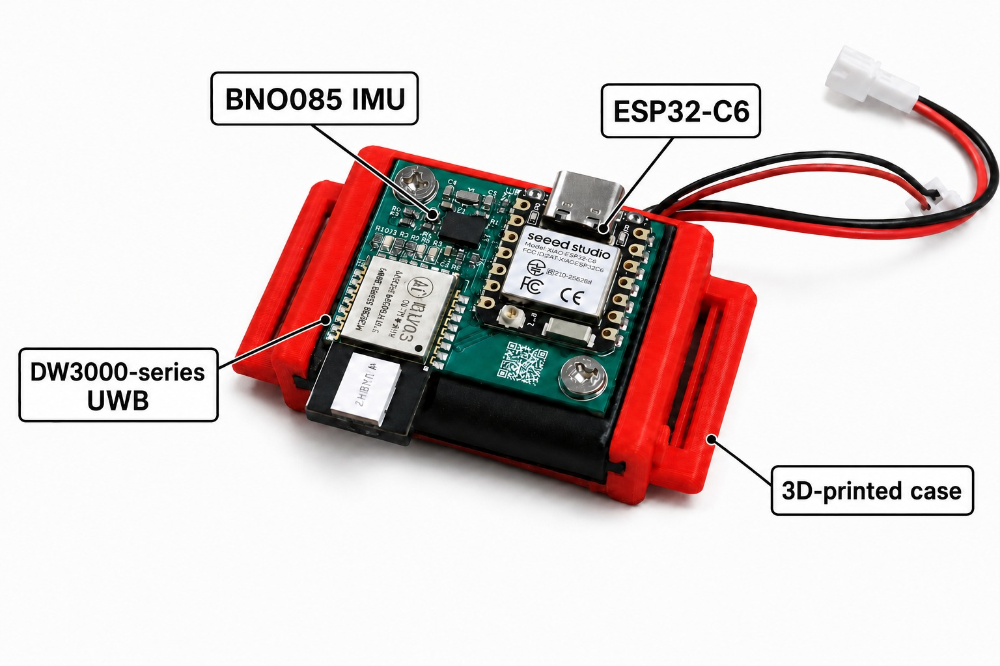

# WaviTrack

> [!NOTE]
> Looking for our main conference paper? Read [*WaviTrack: Exploiting Body-Area RF Channels for Wearable Human Motion Reconstruction*](https://doi.org/10.1145/3830727.3834831). For its simulation, ML models, and motion-reconstruction code, see [FranklinTaoTao/WaviTrack-RF-Motion](https://github.com/FranklinTaoTao/WaviTrack-RF-Motion).

*An assembled node, from Figure 1a of the [workshop paper](https://doi.org/10.1145/3798063.3837383) (CC BY 4.0).*

This repository accompanies our workshop paper, [*From PCB to Packets: An Open Hardware and Firmware Foundation for Reproducible Wearable Motion Capture*](https://doi.org/10.1145/3798063.3837383), presented at **Reproduce: The 1st Workshop on Reproducible Methods for Wearable Sensing and Ubiquitous Computing** during **UbiComp/ISWC 2026**. The paper appears in the *UbiComp Companion '26* proceedings.

WaviTrack covers the wearable measurement path from board design to IMU, UWB range, and CIR packets.

## Contents

- `hardware/v2/`: XIAO ESP32-C3/BNO055 board; KiCad design, BOM, and fabrication files.
- `hardware/v3/`: XIAO ESP32-C6/BNO085 board; KiCad design, BOM, and fabrication files.
- `enclosure/`: printable PCB carrier and strap mount for both board revisions.
- `firmware/`: modified DW3000 driver, board examples, V3 six-node collection, and Python capture tools. See the [firmware guide](firmware/README.md).

Use the KiCad files, BOM, and `fabrication/` outputs from the **same revision** when making a board. During assembly, keep the UWB antenna region clear and orient the board consistently in its carrier. For a first radio check, use the pairwise ranging sketches before running six-node collection.

## License

WaviTrack-authored material is released under the Apache License, Version 2.0; see [LICENSE](LICENSE). The cover image is reproduced from the CC BY 4.0 workshop paper. Bundled third-party material keeps its own terms. In particular, the Seeed Studio XIAO KiCad library and its footprint copies are covered by [CC BY-SA 4.0](<hardware/v3/Seeed Studio XIAO Series Library/LICENSE.md>). See [NOTICE](NOTICE) and the notices in individual files for attribution.
